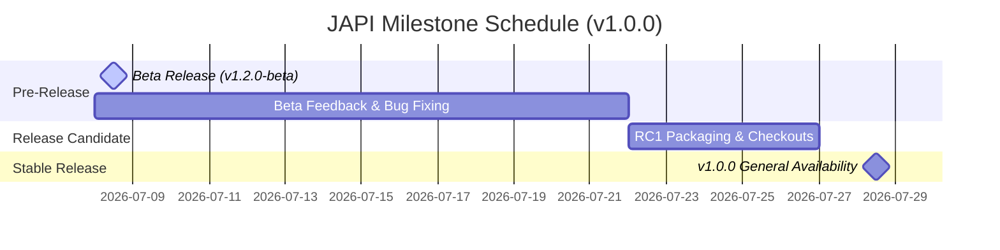

# JAPI Release Plan — v1.2.0-beta

This document outlines the release plan for **JAPI (v1.2.0-beta)**, the offline-first API client, detailing the beta entry criteria, verification methods, distribution strategy, and milestones for the final stable release.

---

## 1. Release Goals

JAPI's transition to the `1.2.0-beta` pre-release phase aims to achieve the following:
* **Feature Freeze**: Baseline core features including HTTP request builder, scripting, collection running, environments, zoom controls, and theme toggling.
* **Local Sandboxing Validation**: Verify that the application functions 100% offline without local network leaks or internet requirements.
* **Interoperability Check**: Ensure standard Postman Collection (v2.1) and Environment files import and export seamlessly.
* **Stabilization**: Collect community feedback and log reports to fix interface scaling issues, visual bugs, or script engine runtime errors.

---

## 2. Beta Feature Scope
 
Here is the current implementation status of features included in the **v1.2.0-beta** release:
 
| Category | Feature Name | Description | Status |
| :--- | :--- | :--- | :--- |
| **Security & Storage** | Offline-First Architecture | Zero external servers or telemetry. Data stored locally under user-controlled directories. | **Verified** |
| **Security & Storage** | Hierarchical SSL Governance | Recursive SSL policy inheritance (Inherit, Verify, Do Not Verify) down to requests, overridden by Global Forced policies. | **Verified** |
| **Security & Storage** | OAuth 2.0 Authorization | Full native support for Authorization Code, Password, and Client Credentials token generation with embedded browser flow. | **Verified** |
| **HTTP Engine** | Async Client Wrapper | Java 21 `HttpClient` wrapping SwingWorker threads to prevent UI lockup. | **Verified** |
| **HTTP Engine** | Network Time Breakdown | Granular telemetry separating Pre-request script, Network Request, and Test Script execution timings. | **Verified** |
| **Environments** | Variable Interpolation | Substitutes variables matching `{{variable}}` syntax inside URLs, parameters, headers, and bodies. | **Verified** |
| **Developer Tools** | JWT Decoder | Decodes headers and payloads of JSON Web Tokens locally. | **Verified** |
| **Data Comparator** | Diff Tool | Compares raw text/JSON payloads side-by-side highlighting additions and deletions. | **Verified** |
| **Mocking** | Local Mock Server | Allows spinning up a mock endpoint binding to custom ports locally. | **Verified** |
| **Automation** | Rhino JS Script Engine | Runs pre-request setups and validation scripts using standard JS. | **Verified** |
| **Automation** | Collection Runner | Batch runs collections with virtual user concurrency and chart analytics. | **Verified** |
| **DX** | UI Zoom / Scaling | Scalable UI and fonts dynamically using standard `Ctrl + = / -` keys. | **Verified** |
| **DX** | Tab Management | Pin, Rename, Close Others, Close to Left/Right options for requests. | **Verified** |
| **DX** | Location Preserver | Keeps track of and automatically opens all file dialogs in the directory of the last selected file. | **Verified** |
| **DX** | Multi-File Importer | Import both Collections and Environments from the same multi-selected files via top menu, sidebar, or Environment Manager. | **Verified** |
 
> [!NOTE]
   > All settings, including custom data and log directories, persist correctly across application restarts.

---

## 3. Distribution & Packaging

The application is bundled into a standalone offline-distributable archive.

### Distribution Artifacts
* **Target executable**: `japi-1.2.0-beta.jar` (Shaded fat JAR containing all dependencies).
* **Package formats**: `.zip` and `.tar.gz` archive containing launch scripts.
* **Launch scripts**:
  - `japi.bat`: Script to run the application on Windows (`javaw -jar japi-1.2.0-beta.jar`).
  - `japi.sh`: Script to run the application on macOS/Linux (configured with executable permissions `0755`).

### Packaging Pipeline
The package is created via:
```bash
mvn clean package -DskipTests
```
This produces `target/japi.zip` which unzips to:
```
japi/
├── japi-1.2.0-beta.jar
├── japi.bat
└── japi.sh
```

> [!TIP]
> The packaging process uses Maven Assembly resource filtering, ensuring launch scripts are automatically updated with the exact project version defined in `pom.xml`.

---

## 4. Beta Testing & Verification Plan

During the beta phase, testing will focus on three key pillars:

### A. Interoperability & Import/Export
- [x] Import major Postman collection and environment types (v2.1 schemas) with multi-file auto-detect selection.
- [x] Export environment variables and collections and load them back into Postman without format warnings.
- [x] Verify directory-level changes are saved as human-readable JSON files that can be easily tracked via Git.

### B. JavaScript Sandbox (Rhino) Execution
- [x] Validate pre-request scripts modifying headers dynamically.
- [x] Validate assertions using `pm.test` style syntax.
- [x] Monitor memory footprint during large collection runs to avoid script-engine leaks.

### C. Network & SSL Settings
- [x] Verify self-signed certificates work by querying local mock endpoints running on HTTPS.
- [x] Check mock server stability when binding/unbinding ports.
- [x] Verify SSL policies recursively cascade from root collections/folders to child requests.
- [x] Validate forced global policies override request and collection configurations.

---

## 5. Milestone to v1.0.0 Stable Release



### v1.0.0 Entry Criteria
1. No critical GUI-freezing bugs under Java 21 runtime.
2. Complete trust verification for localhost self-signed SSL connections.
3. Stable tab layout state retention during zoom adjustments.
4. Polished PDF and Excel export reports for Collection Runner logs.
